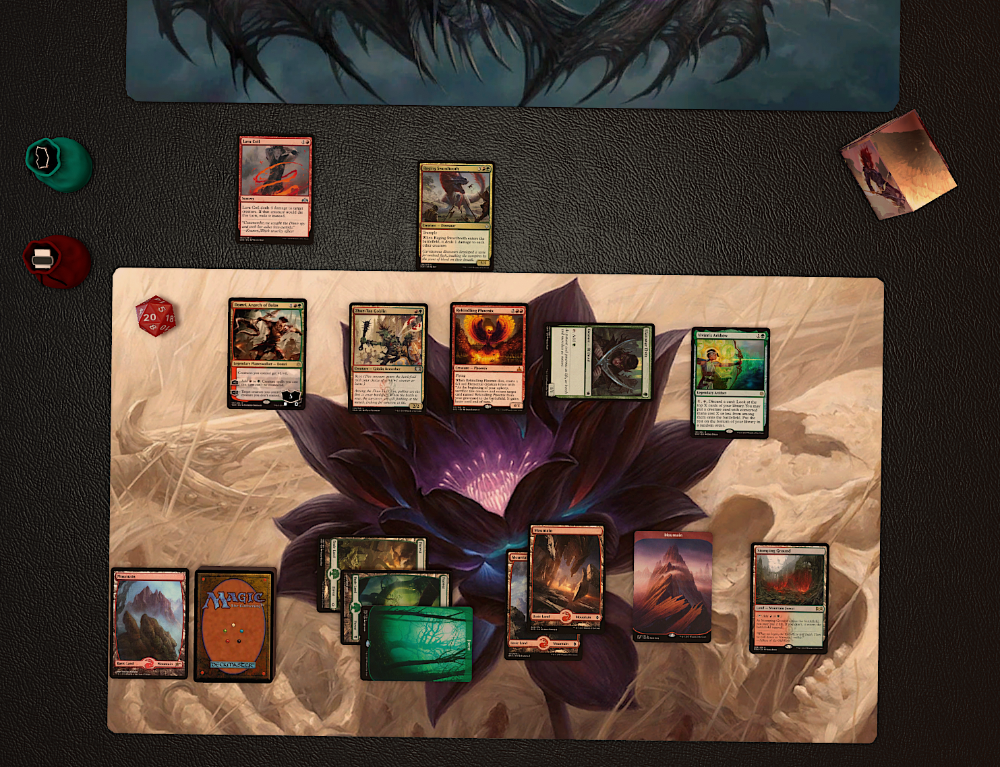

# Tabletop Simulator Assets

## Install

1. Enter your TTS `saved objects` directory. Default: `C:\Users\USERNAME\Documents\My Games\Tabletop Simulator\Saves\Saved Objects`
2. `Right Click` > `Git Bash here` > `git clone https://github.com/t89/tts.git`
3. As game administrator click on `Saved Objects` and import the assets.
